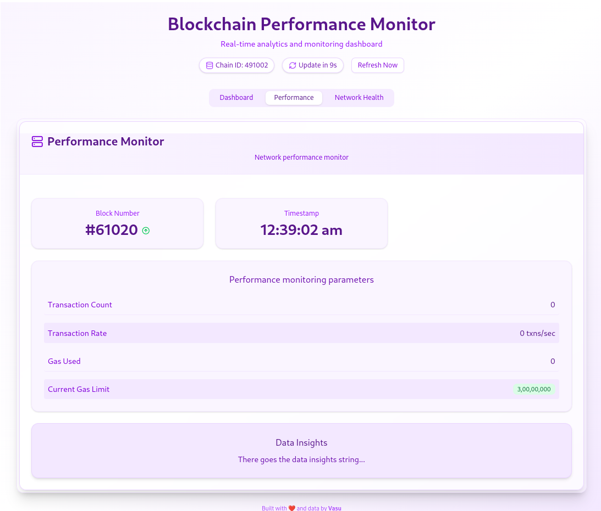
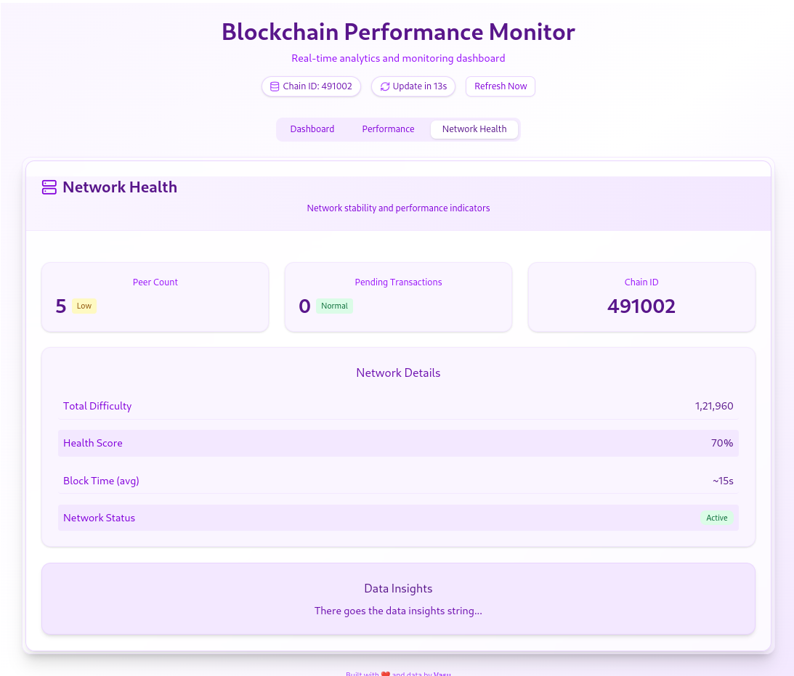

# Blockchain Network Health Monitor

## Overview
This project aims to build a **Blockchain Network Performance Monitor** to track essential performance metrics such as block times, transaction counts, gas usage, and validator activity. It provides real-time insights into network performance and health, helping developers and network operators monitor and optimize blockchain operations.

## Features
- **Performance Monitoring**: Tracks block times, transaction counts, and gas usage trends.
- **Health Analysis**: Analyzes network health and detects anomalies.
- **Validator Activity Tracking**: Monitors validator participation and performance.
- **Dashboard Interface**: A user-friendly dashboard to visualize key metrics.
- **Real-time Data Processing**: Fetches and processes blockchain network data periodically.

## Technologies Used
- **Backend**: Node.js with Web3.js for data fetching, Python (Flask) for analytics.
- **Database**: Stores historical metrics for trend analysis.
- **Visualization**: React-based dashboard for displaying network insights.
- **Monitoring Tools**: Prometheus and Node Exporter for system metrics.

## Screenshots

### Dashboard Overview

### Performance Monitor

### Network Health

